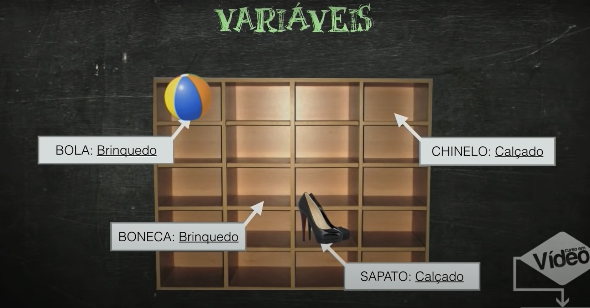

## O que são variáveis?

Variaveis são espaços que podem ser preenchidos com valores, uma variável não pode ter mais que 1 valor.

**var identificador: tipo**
**var bola(identificador): brinquedo(tipo)**

### Identificadores

Identificam determinadas variáveis

**Regras:**
* Deve começar com uma **letra**.
* Os próximos podem sert **letras** ou **números**.
* Não pode utilizar nenhum **símbolo**, exceto **_** *underline*.
* Não pode conter **espaços** em branco.
* Não pode conter letras com **acentos**.
* Não pode ser uma palavra **reservada**.